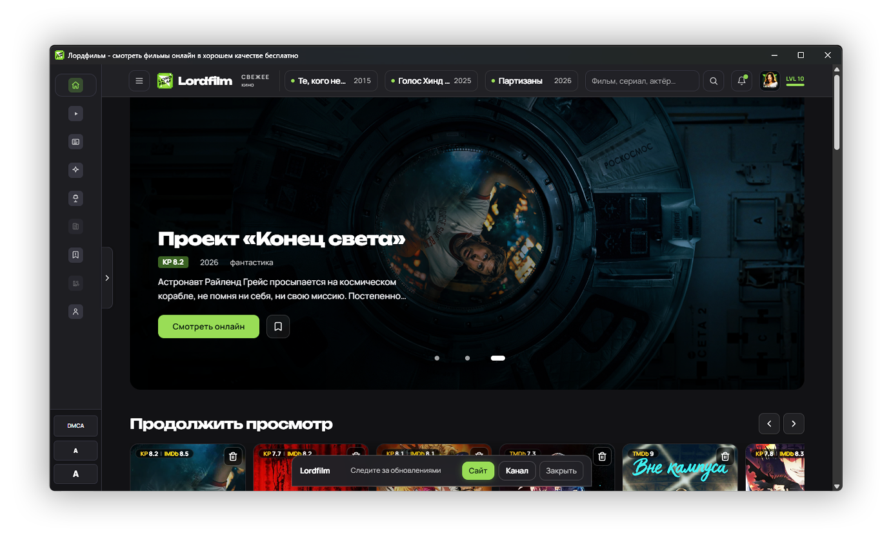

<p align="center">
  
</p>

<h1 align="center">Lordfilm App</h1>

<p align="center">
  A simple Lordfilm client for Windows, Android, and Android TV.
</p>

<p align="center">
  <a href="https://now.smotret-lordfilm.cam/">Web</a> ·
  <a href="https://github.com/lordfilm-app/lordfilm/releases">Download</a> ·
  <a href="https://github.com/lordfilm-app/lordfilm/discussions">Community</a> ·
  <a href="README.md">Русский</a>
</p>

<p align="center">
  <a href="https://github.com/lordfilm-app/lordfilm/releases"></a>
  
  
  
</p>

<p align="center">
  
</p>

## Download

| Platform | File |
|----------|------|
| Windows | `Lordfilm-Setup-*.exe` |
| Android | `lordfilm-android-*.apk` |
| Android TV | `lordfilm-android-tv-*.apk` |
| Web | [now.smotret-lordfilm.cam](https://now.smotret-lordfilm.cam/) |

All installers are available in [Releases](https://github.com/lordfilm-app/lordfilm/releases).

## Features

- Fast Windows app with auto-updates.
- APK for Android phones.
- Separate Android TV build for remote navigation.
- Web version for quick access without installation.
- Release notes and checksums for every version.

## Discussions

- [Announcements](https://github.com/lordfilm-app/lordfilm/discussions/categories/announcements) — news and releases.
- [Help](https://github.com/lordfilm-app/lordfilm/discussions/categories/q-a) — install, launch, and app questions.
- [Android TV](https://github.com/lordfilm-app/lordfilm/discussions/categories/q-a) — TV build, remote navigation, focus, and scaling.
- [Ideas](https://github.com/lordfilm-app/lordfilm/discussions/categories/ideas) — suggestions and improvements.
- [General](https://github.com/lordfilm-app/lordfilm/discussions/categories/general) — feedback and casual discussion.
- [Polls](https://github.com/lordfilm-app/lordfilm/discussions/categories/polls) — vote for upcoming improvements.

## Android via Obtainium

You can add the app to [Obtainium](https://github.com/ImranR98/Obtainium) to get APK update notifications.

Repo URL:

```text
https://github.com/lordfilm-app/lordfilm
```

APK filters:

```text
Phone: lordfilm-android-.*\.apk
TV:    lordfilm-android-tv-.*\.apk
```

## FAQ

**Where can I download the latest version?**  
Use [Releases](https://github.com/lordfilm-app/lordfilm/releases).

**Is there an Android TV version?**  
Yes, use `lordfilm-android-tv-*.apk`.

**Can I use it without installing the app?**  
Yes, open the [web version](https://now.smotret-lordfilm.cam/).

**Where should I report problems?**  
Bugs go to [Issues](https://github.com/lordfilm-app/lordfilm/issues), questions and ideas go to [Discussions](https://github.com/lordfilm-app/lordfilm/discussions).

## SEO

Lordfilm App for Windows, Android and Android TV: desktop client, APK releases, Android TV build, web version, and release notes on GitHub.

## Support

- [Support](SUPPORT.md)
- [Discussions setup](DISCUSSIONS.md)
- [Changelog](CHANGELOG.md)
- [Security](SECURITY.md)
- [Rights holders](RIGHTSHOLDERS.md)
