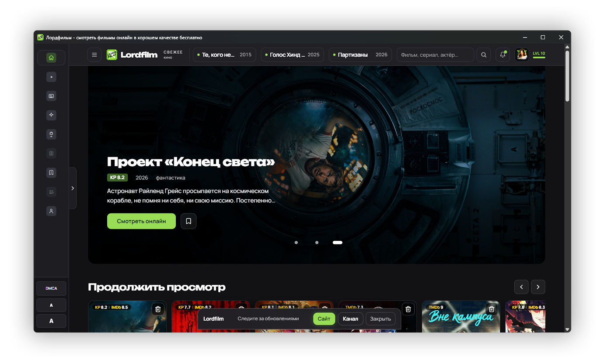

<p align="center">
  
</p>

<h1 align="center">╨Ы╨╛╤А╨┤╤Д╨╕╨╗╤М╨╝</h1>

<p align="center">
  ╨г╨┤╨╛╨▒╨╜╤Л╨╣ ╨║╨╗╨╕╨╡╨╜╤В Lordfilm ╨┤╨╗╤П Windows, Android ╨╕ Android TV.
</p>

<p align="center">
  <a href="https://now.smotret-lordfilm.cam/" target="_blank"></a>
  <a href="https://github.com/lordfilm-app/lordfilm/releases"></a>
  <a href="https://github.com/lordfilm-app/lordfilm/discussions"></a>
  
  <a href="README.en.md"></a>
</p>

<p align="center">
  <a href="https://github.com/lordfilm-app/lordfilm/releases"></a>
  <a href="https://github.com/lordfilm-app/lordfilm/releases/download/v1.0.10/LORDFILM-Setup-0.0.10.exe"></a>
  <a href="https://github.com/lordfilm-app/lordfilm/releases/download/v1.0.10/lordfilm-android-1.0.10.apk"></a>
  <a href="https://github.com/lordfilm-app/lordfilm/releases/download/v1.0.10/lordfilm-android-tv-0.0.2.apk"></a>
</p>

<p align="center">
  
</p>

## ╨б╨║╨░╤З╨░╤В╤М

| ╨Я╨╗╨░╤В╤Д╨╛╤А╨╝╨░ | ╨б╨║╨░╤З╨░╤В╤М |
|----------|---------|
| Windows | [LORDFILM-Setup-0.0.10.exe](https://github.com/lordfilm-app/lordfilm/releases/download/v1.0.10/LORDFILM-Setup-0.0.10.exe) |
| Android | [lordfilm-android-1.0.10.apk](https://github.com/lordfilm-app/lordfilm/releases/download/v1.0.10/lordfilm-android-1.0.10.apk) |
| Android TV | [lordfilm-android-tv-0.0.2.apk](https://github.com/lordfilm-app/lordfilm/releases/download/v1.0.10/lordfilm-android-tv-0.0.2.apk) |
| Web | [now.smotret-lordfilm.cam](https://now.smotret-lordfilm.cam/) |

╨Т╤Б╨╡ ╨▓╨╡╤А╤Б╨╕╨╕ ╨╕ checksums ╨┤╨╛╤Б╤В╤Г╨┐╨╜╤Л ╨▓ [Releases](https://github.com/lordfilm-app/lordfilm/releases).

## ╨Т╨╛╨╖╨╝╨╛╨╢╨╜╨╛╤Б╤В╨╕

- Windows-╨┐╤А╨╕╨╗╨╛╨╢╨╡╨╜╨╕╨╡ ╤Б ╨▒╤Л╤Б╤В╤А╤Л╨╝ ╨╖╨░╨┐╤Г╤Б╨║╨╛╨╝ ╨╕ ╨░╨▓╤В╨╛╨╛╨▒╨╜╨╛╨▓╨╗╨╡╨╜╨╕╤П╨╝╨╕.
- APK ╨┤╨╗╤П Android-╤Б╨╝╨░╤А╤В╤Д╨╛╨╜╨╛╨▓.
- ╨Ю╤В╨┤╨╡╨╗╤М╨╜╨░╤П ╤Б╨▒╨╛╤А╨║╨░ ╨┤╨╗╤П Android TV ╨╕ ╤Г╨┐╤А╨░╨▓╨╗╨╡╨╜╨╕╤П ╤Б ╨┐╤Г╨╗╤М╤В╨░.
- ╨Т╨╡╨▒-╨▓╨╡╤А╤Б╨╕╤П ╨┤╨╗╤П ╨▒╤Л╤Б╤В╤А╨╛╨│╨╛ ╨▓╤Е╨╛╨┤╨░ ╨▒╨╡╨╖ ╤Г╤Б╤В╨░╨╜╨╛╨▓╨║╨╕.
- Release notes ╨╕ checksums ╨┤╨╗╤П ╨║╨░╨╢╨┤╨╛╨╣ ╨▓╨╡╤А╤Б╨╕╨╕.

## ╨Ю╨▒╤Б╤Г╨╢╨┤╨╡╨╜╨╕╤П

- [╨Р╨╜╨╛╨╜╤Б╤Л](https://github.com/lordfilm-app/lordfilm/discussions/categories/announcements) тАФ ╨╜╨╛╨▓╨╛╤Б╤В╨╕ ╨╕ ╤А╨╡╨╗╨╕╨╖╤Л.
- [╨Я╨╛╨╝╨╛╤Й╤М](https://github.com/lordfilm-app/lordfilm/discussions/categories/q-a) тАФ ╤Г╤Б╤В╨░╨╜╨╛╨▓╨║╨░, ╨╖╨░╨┐╤Г╤Б╨║ ╨╕ ╨▓╨╛╨┐╤А╨╛╤Б╤Л ╨┐╨╛ ╨┐╤А╨╕╨╗╨╛╨╢╨╡╨╜╨╕╤О.
- [Android TV](https://github.com/lordfilm-app/lordfilm/discussions/categories/q-a) тАФ TV-╨▓╨╡╤А╤Б╨╕╤П, ╨┐╤Г╨╗╤М╤В, ╤Д╨╛╨║╤Г╤Б ╨╕ ╨╝╨░╤Б╤И╤В╨░╨▒.
- [╨Ш╨┤╨╡╨╕](https://github.com/lordfilm-app/lordfilm/discussions/categories/ideas) тАФ ╨┐╤А╨╡╨┤╨╗╨╛╨╢╨╡╨╜╨╕╤П ╨┐╨╛ ╤Г╨╗╤Г╤З╤И╨╡╨╜╨╕╤П╨╝.
- [╨Ю╨▒╤Й╨╡╨╡](https://github.com/lordfilm-app/lordfilm/discussions/categories/general) тАФ ╨▓╨┐╨╡╤З╨░╤В╨╗╨╡╨╜╨╕╤П ╨╕ ╨╛╨▒╤А╨░╤В╨╜╨░╤П ╤Б╨▓╤П╨╖╤М.
- [╨У╨╛╨╗╨╛╤Б╨╛╨▓╨░╨╜╨╕╤П](https://github.com/lordfilm-app/lordfilm/discussions/categories/polls) тАФ ╤З╤В╨╛ ╤Г╨╗╤Г╤З╤И╨╕╤В╤М ╨▓ ╤Б╨╗╨╡╨┤╤Г╤О╤Й╨╕╤Е ╨▓╨╡╤А╤Б╨╕╤П╤Е.

## Android ╤З╨╡╤А╨╡╨╖ Obtainium

╨Ь╨╛╨╢╨╜╨╛ ╨┤╨╛╨▒╨░╨▓╨╕╤В╤М ╨┐╤А╨╕╨╗╨╛╨╢╨╡╨╜╨╕╨╡ ╨▓ [Obtainium](https://github.com/ImranR98/Obtainium), ╤З╤В╨╛╨▒╤Л ╨┐╨╛╨╗╤Г╤З╨░╤В╤М ╤Г╨▓╨╡╨┤╨╛╨╝╨╗╨╡╨╜╨╕╤П ╨╛ ╨╜╨╛╨▓╤Л╤Е APK.

URL ╤А╨╡╨┐╨╛╨╖╨╕╤В╨╛╤А╨╕╤П:

```text
https://github.com/lordfilm-app/lordfilm
```

APK-╤Д╨╕╨╗╤М╤В╤А╤Л:

```text
Phone: lordfilm-android-.*\.apk
TV:    lordfilm-android-tv-.*\.apk
```

## FAQ

**╨У╨┤╨╡ ╤Б╨║╨░╤З╨░╤В╤М ╨┐╨╛╤Б╨╗╨╡╨┤╨╜╤О╤О ╨▓╨╡╤А╤Б╨╕╤О?**  
╨Т ╤А╨░╨╖╨┤╨╡╨╗╨╡ [Releases](https://github.com/lordfilm-app/lordfilm/releases).

**╨Х╤Б╤В╤М ╨▓╨╡╤А╤Б╨╕╤П ╨┤╨╗╤П Android TV?**  
╨Ф╨░, ╨╕╤Б╨┐╨╛╨╗╤М╨╖╤Г╨╣╤В╨╡ ╤Д╨░╨╣╨╗ `lordfilm-android-tv-*.apk`.

**╨Ь╨╛╨╢╨╜╨╛ ╨╗╨╕ ╨┐╨╛╨╗╤М╨╖╨╛╨▓╨░╤В╤М╤Б╤П ╨▒╨╡╨╖ ╤Г╤Б╤В╨░╨╜╨╛╨▓╨║╨╕?**  
╨Ф╨░, ╨╛╤В╨║╤А╨╛╨╣╤В╨╡ [╨▓╨╡╨▒-╨▓╨╡╤А╤Б╨╕╤О](https://now.smotret-lordfilm.cam/).

**╨Ъ╤Г╨┤╨░ ╨┐╨╕╤Б╨░╤В╤М ╨╛ ╨┐╤А╨╛╨▒╨╗╨╡╨╝╨░╤Е?**  
╨С╨░╨│╨╕ тАФ ╨▓ [Issues](https://github.com/lordfilm-app/lordfilm/issues), ╨▓╨╛╨┐╤А╨╛╤Б╤Л ╨╕ ╨╕╨┤╨╡╨╕ тАФ ╨▓ [Discussions](https://github.com/lordfilm-app/lordfilm/discussions).

## SEO

Lordfilm App тАФ ╨┐╤А╨╕╨╗╨╛╨╢╨╡╨╜╨╕╨╡ ╨┤╨╗╤П Windows, Android ╨╕ Android TV: ╤Г╨┤╨╛╨▒╨╜╤Л╨╣ ╨║╨╗╨╕╨╡╨╜╤В, APK-╤А╨╡╨╗╨╕╨╖╤Л, Android TV build, ╨▓╨╡╨▒-╨▓╨╡╤А╤Б╨╕╤П, ╨╛╨▒╨╜╨╛╨▓╨╗╨╡╨╜╨╕╤П ╤З╨╡╤А╨╡╨╖ GitHub Releases.

## ╨Я╨╛╨┤╨┤╨╡╤А╨╢╨║╨░

- [╨Я╨╛╨┤╨┤╨╡╤А╨╢╨║╨░](https://github.com/lordfilm-app/lordfilm/discussions/categories/q-a)
- [╨Ю╨▒╤Б╤Г╨╢╨┤╨╡╨╜╨╕╤П](https://github.com/lordfilm-app/lordfilm/discussions)
- [Changelog](https://github.com/lordfilm-app/lordfilm/releases)
- [Security](https://github.com/lordfilm-app/lordfilm/security/policy)
- [╨Я╤А╨░╨▓╨╛╨╛╨▒╨╗╨░╨┤╨░╤В╨╡╨╗╤П╨╝](https://github.com/lordfilm-app/lordfilm/blob/main/RIGHTSHOLDERS.md)
